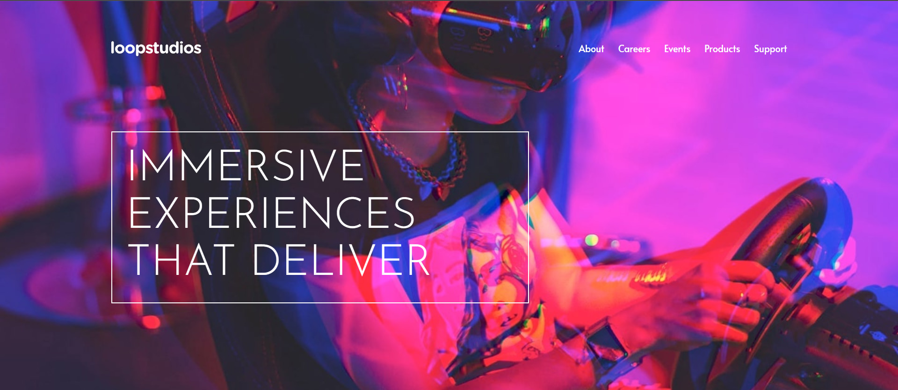

# Frontend Mentor - Loopstudios landing page

## Welcome! 👋

Thanks for checking out this front-end coding challenge.

[Frontend Mentor](https://www.frontendmentor.io) challenges help you improve your coding skills by building realistic projects.

**To do this challenge, you need a good understanding of HTML and CSS and a basic understanding of JavaScript.**

## I tried to make a completely flex page

Not supported:

Non-standard aspect ratios for mobile devices. like Galaxy Fold.
Surface Pro.
